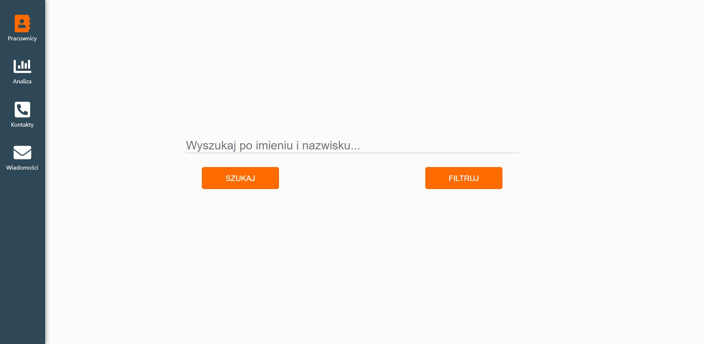
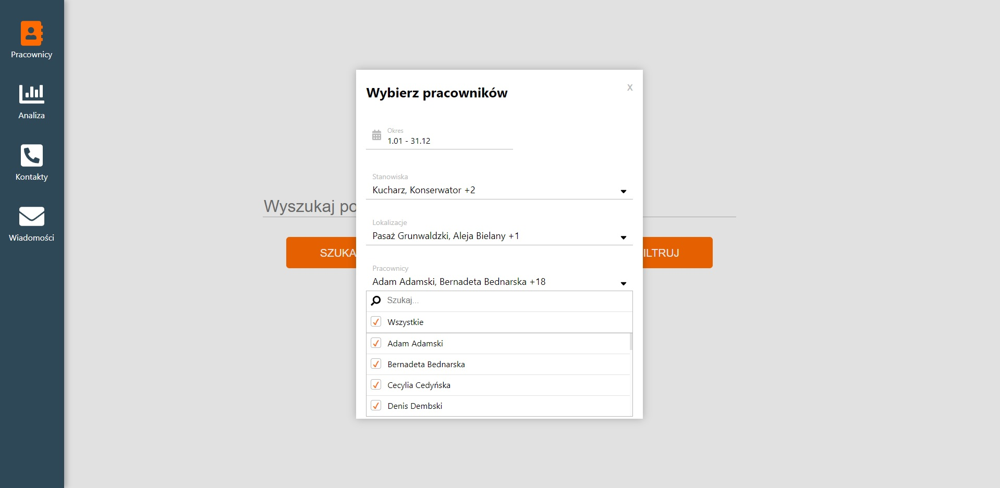
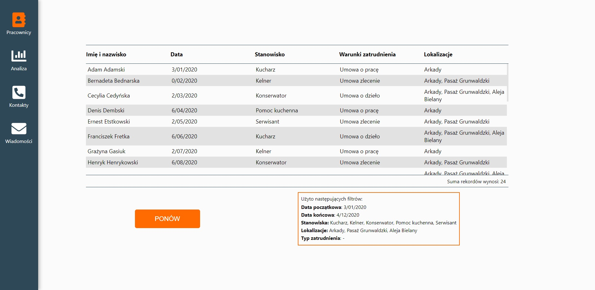

# Simple modal filter app

## Project run

To run application clone or download source code and in project diretory run:

### `npm i`

After packages instalation run:

### `npm start`

Application will be running in development mode at address [http://localhost:3000](http://localhost:3000)

## Live demo

To see live demo please visit [this link](https://mkaliszewski.github.io/modal-filter-app/)

## Preview

